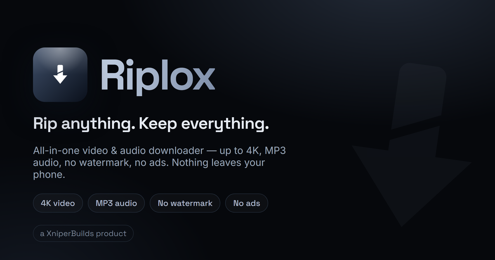
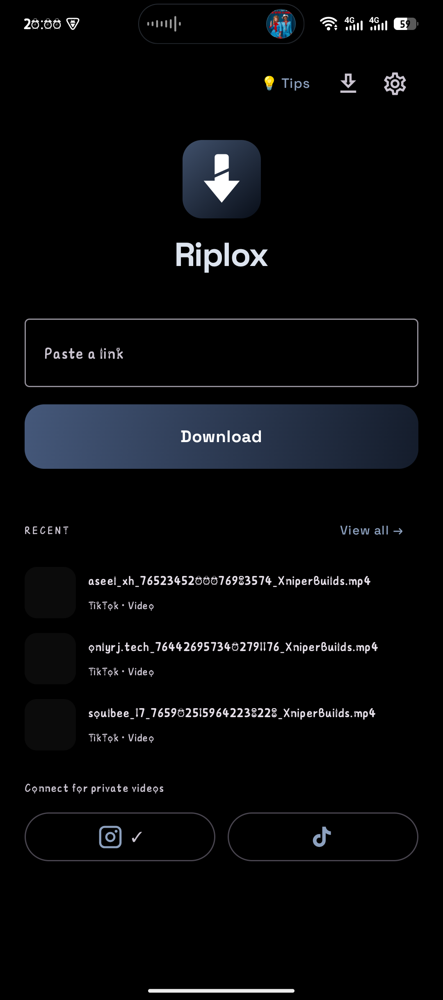
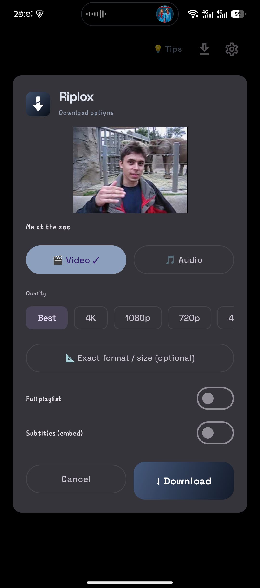
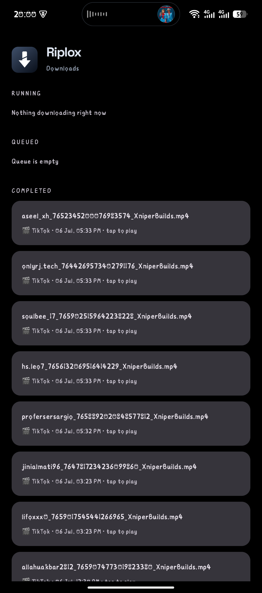
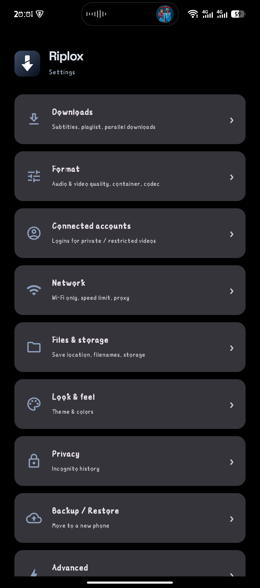

<div align="center">


# Riplox

**Rip anything. Keep everything.**

Free & open-source video / audio downloader for Android — 1000+ sites, up to 4K, MP3, no ads, no watermarks.

[](https://github.com/xniperbuilds/riplox/releases/latest)
[](https://github.com/xniperbuilds/riplox/releases)
[](LICENSE)




</div>

---

## Screenshots

| Home | Download options | Downloads | Settings |
|:---:|:---:|:---:|:---:|
|  |  |  |  |

## Features

- ⬇ **1000+ sites** — YouTube, Instagram, TikTok, Facebook, X and everything [yt-dlp](https://github.com/yt-dlp/yt-dlp) supports
- 🎬 **Up to 4K video**, exact format/size picker, MP4 / MKV / WEBM
- 🎵 **Audio extraction** — MP3, M4A, OPUS, WAV, FLAC with embedded cover art
- ⚡ **Instant share-download** — share a link from any app, zero taps
- 🧠 **Smart defaults** — the download popup remembers your choices
- 📊 **Downloads manager** — live progress, queue, one-tap retry for failures
- 🔁 **Background queue** — survives app close and reboot, auto-retry with backoff
- 🔗 **Account connect** — sign in on the real site (in-app) to unlock private / age-restricted / guest-blocked videos; your password never touches the app
- 🔒 **Secret Vault** — fingerprint/PIN-locked hidden storage; vault files disappear from gallery, history and backups
- 📜 **History & Trash** — search, filter, multi-select, link export/import (optionally password-protected file)
- 🎨 **Clean dark UI** — AMOLED black, Material 3, no clutter
- 🚫 **No ads. No tracking. No analytics.** No ad SDK, no advertiser, nothing sold — just a strip pointing at our own apps.

## Install

1. Download the latest APK from [**Releases**](https://github.com/xniperbuilds/riplox/releases/latest)
2. Open it — allow *"Install from unknown sources"* if Android asks
3. Done. Open Riplox, paste a link, hit **Download**

> **Note:** Riplox is not on the Play Store. The APK here is the only official source.

## Why Riplox?

Most "downloader" apps are ad-walls with broken engines. Riplox is built on the same battle-tested engine family used by the best open-source tools (yt-dlp + FFmpeg + aria2c), wrapped in a fast native Android app with zero ads — and a few things nobody else has, like the biometric Secret Vault and cross-device link packs.

## FAQ

**Instagram / private videos fail?**
Sites now block guest downloads. Open Settings → Connected accounts → tap the site → log in on the real site inside the app. The ✓ appears only after a real login.

**Where do files go?**
Gallery (`Movies/XniperBuilds/<site>`, audio in `Music/…`) — or any folder/SD card you pick in Settings → Files.

**Is it safe?**
Open source — read the code. No ad SDK, no analytics, no account. Besides the download itself the app makes exactly two other calls, both to the site in question: a once-a-day check on GitHub for a newer Riplox, and — on Instagram links, and only when you are logged in — a direct call to Instagram so photo posts work at all. Logins happen on the official site inside a WebView; only the resulting cookies are stored, on your phone, and you can delete them anytime.

**Video won't download?**
Update the engine (Settings → About → Update engine), try again, or use Exact format in the download popup.

## Building from source

```bash
git clone https://github.com/xniperbuilds/riplox.git
cd riplox
./gradlew assembleDebug
```

Android Studio (JDK 17+) recommended. Release builds are signed with the maintainer's key; your builds fall back to a debug signature automatically.

## Credits

- [yt-dlp](https://github.com/yt-dlp/yt-dlp) · [youtubedl-android](https://github.com/yausername/youtubedl-android) · [FFmpeg](https://ffmpeg.org/) · [aria2](https://aria2.github.io/)
- [ExoPlayer / Media3](https://github.com/androidx/media) · [Coil](https://coil-kt.github.io/coil/) · Jetpack Compose / Material 3

## License

[GPL-3.0](LICENSE) — free forever. If you distribute a modified version, it must stay open source.

---

<div align="center">

**Riplox** is a [XniperBuilds](https://xniperbuilds.com) product.

⭐ Star the repo if Riplox saves you time — it helps more people find it.

</div>
